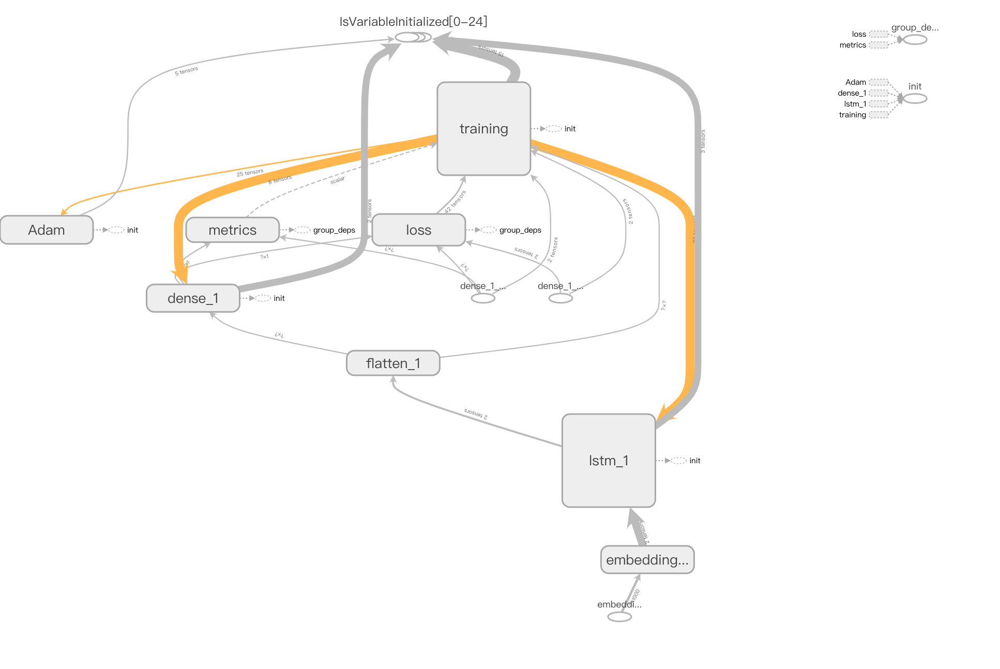
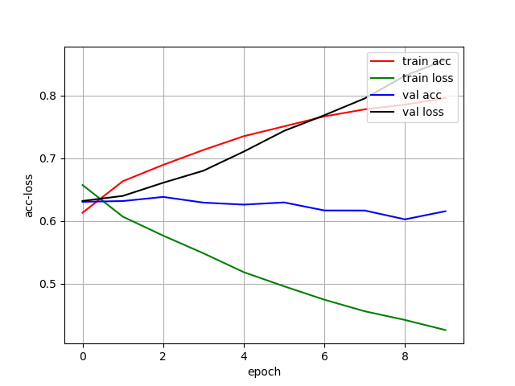
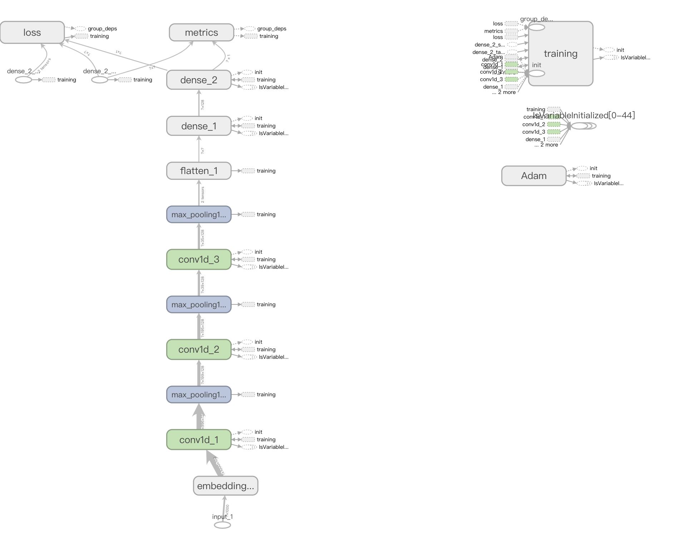
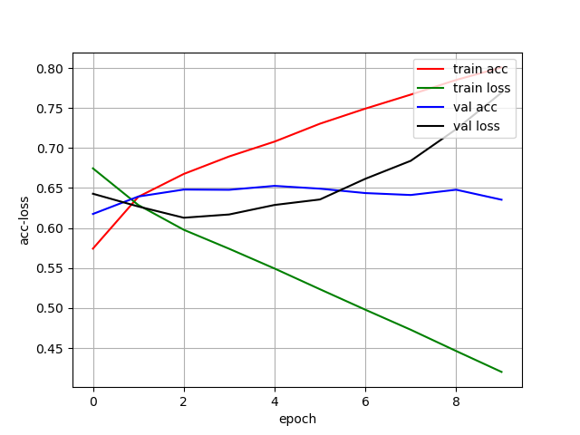
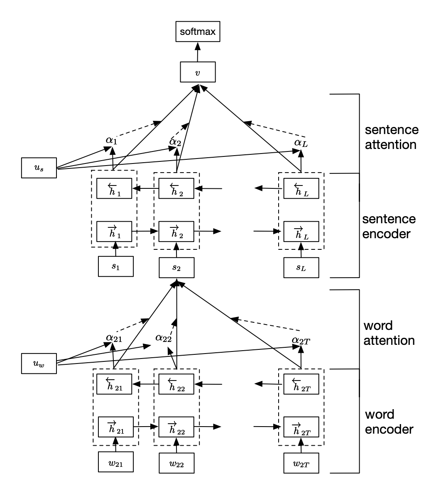
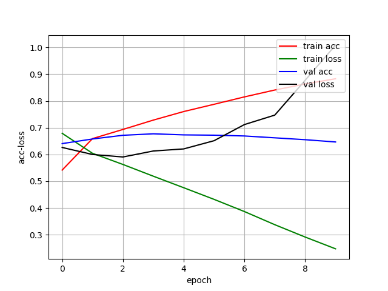

# Semantic-Coherence

This project aims to judge whether a context is coherent in meaning or not. As far as I know, it's quite a challenging task. I finally get the result of 71.81% accuracy in the validation set.

The raw data is in the format of text, I first use [data.py](./data.py) to extract useful information and store them in numpy or txt format. After that, gensim package is used to deploy Word2Vec method on the words extracted before and get the embedding vectors which are also stored in npy files in [word2vec_model.py](./word2vec_model.py)

Below are methods I have tried and their performance. Notice that for deep learning methods since I don't have enough time for adjusting parameters, so the performance is limitted and can be improved obviously. 

I provide the raw data and all my code in this repo.

## KNN

All code is in [knn.py](./knn.py). I try the different distance functions which bring improvement in performance while I also train different Word2Vec models(window length) which seems not work.

|window length|distance function|k = 1|k = 3|k = 5|k = 7|k = 9|
|---|---|---|---|---|---|---|
|5|l1 distance|50.43%|50.44%|50.05%|50.50%|49.94%|
|5|l1_abs distance|51.21%|52.43%|52.53%|53.33%|53.53%|
|5|l2 distance|52.19%|52.69%|52.48%|52.96%|53.81%|
|10|l1 distance|50.02%|49.76%|50.32%|50.48%|50.37%|
|10|l1_abs distance|51.42%|51.84%|52.96%|53.31%|53.42%|
|10|l2 distance|51.97%|52.49%|52.85%|53.63%|53.92%|

## SVM

For the SVM method, I just simply used the SVM package in sklearn to do that. Code is in [svm.py](./svm.py). There is a little promotion in the performance which reaches 57.13% accuracy in validation set. Different Word2Vec still not work so I won't try to use them in the deep learning method.

|window length|acc|
|:---:|---|
|5|57.13%|
|10|56.81%|

## Naive LSTM

For deep learning methods, I first try the naive LSTM model, code is in [lstm.py](./lstm.py). It works quite well which can get 63.83% accuracy. But it's clear that the overfitting situation is very severe, so you can choose to add l2 regularizer to the net.

### Net Structure

### acc-loss Graph

## TextCNN

Then I try a simple CNN network to classify the text, code is in [cnn.py](./cnn.py) It shows a imporvement on this task and reaches 65.27% accuracy. What's more important is that it trains much faster than LSTM. Overfitting also exsits here.

### Net Structure

### acc-loss Graph

## Hierarchical Attention Network

This method is based on paper [Hierarchical Attention Networks for Document Classification](https://www.cs.cmu.edu/~diyiy/docs/naacl16.pdf), code is in [han.py](./han.py) It uses Attention to focus on important things for classification and a single model can reach 68.83% accuracy. To further improve performance, I combine 5 models
to inference and get 71.81% accuracy, code is in [inference.py](./inference.py)

### Net Structure

### acc-loss Graph
